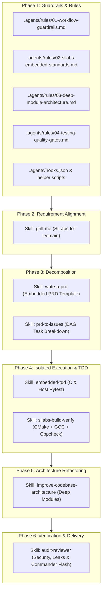

# Implementation Plan: Silicon Labs IoT AI Coding System for Antigravity 2.0

Xây dựng hệ thống toàn diện các file **Rules, Skills, Hooks, Plugin và Guidelines** cho Antigravity 2.0, được tối ưu hóa chuyên sâu cho kỹ sư phần mềm nhúng phát triển các ứng dụng IoT trên nền tảng Silicon Labs (EFR32 / Simplicity SDK / Gecko SDK) theo đúng quy trình 6 giai đoạn chuẩn hóa trong file [AI_Coding.mmd](file:///e:/CODE/Silicon_Labs/Simplicity6/empty/AI_Coding.mmd).

---

## User Review Required

> [!IMPORTANT]
> Toàn bộ hệ thống sẽ được triển khai theo 2 cấp độ:
> 1. **Cấp độ Workspace Project (`.agents/`)**: Sử dụng ngay lập tức cho dự án hiện tại, commit trực tiếp lên Git để chia sẻ trong team.
> 2. **Cấp độ Reusable Plugin (`.agents/plugins/silabs-iot-services/`) & Tài liệu Hướng dẫn (`SILABS_ANTIGRAVITY_GUIDE.md`)**: Cho phép tái sử dụng / phân phối bộ quy tắc và kỹ năng này cho bất kỳ dự án Silicon Labs nào khác.

---

## Architecture Overview (Mapping to `AI_Coding.mmd`)

---

## Proposed Changes

### 1. Workspace Rules (`.agents/rules/` & `AGENTS.md`)

Thiết lập các ràng buộc cứng và hướng dẫn kiến trúc cho AI trong workspace:

#### [NEW] [01-workflow-guardrails.md](file:///e:/CODE/Silicon_Labs/Simplicity6/empty/.agents/rules/01-workflow-guardrails.md)
- Định nghĩa quy tắc bắt buộc tuân thủ 6 phase của `AI_Coding.mmd`.
- Quy định chế độ Adaptive: Tính năng mới / Refactor lớn phải qua Grill-me -> PRD -> DAG -> TDD -> Refactor -> Audit; Bugfix nhỏ thực hiện Root cause -> Fix/Build -> Verify.

#### [NEW] [02-silabs-embedded-standards.md](file:///e:/CODE/Silicon_Labs/Simplicity6/empty/.agents/rules/02-silabs-embedded-standards.md)
- Quy chuẩn phát triển trên Simplicity SDK (2026.6.0+) & EFR32MG24 (BRD4187C).
- Nguyên tắc bảo vệ thư mục sinh tự động: **CẤM** sửa file trong `autogen/`, `simplicity_sdk_*/`, `.slps`.
- Tiêu chuẩn lập trình nhúng: Bare-metal event loops (`app_init`, `app_process_action`, `sl_sleeptimer`), FreeRTOS tasks/queues/mutexes, Multi-protocol (BLE, Zigbee, Matter, OpenThread), Quản lý năng lượng (EM0-EM4), Interrupt safety (`CORE_ENTER_ATOMIC()`).

#### [NEW] [03-deep-module-architecture.md](file:///e:/CODE/Silicon_Labs/Simplicity6/empty/.agents/rules/03-deep-module-architecture.md)
- Kiến trúc Deep Module cho C: Public header nhỏ gọn (`src/module/include/*.h`), Internal implementation ẩn tĩnh (`src/module/source/*.c` với `static`), static struct allocation thay cho dynamic memory.
- Kiến trúc Deep Module cho Python Host (`tools/ble_host/`): Minimal API qua `__all__`, private logic với `_`.
- Giới hạn Context Cost: Một module không được bắt AI đọc quá 2 file để nắm interface.

#### [NEW] [04-testing-quality-gates.md](file:///e:/CODE/Silicon_Labs/Simplicity6/empty/.agents/rules/04-testing-quality-gates.md)
- Tiêu chuẩn kiểm thử và build verification: CMake + ARM GCC build passing, Cppcheck static analysis không có cảnh báo nghiêm trọng, Simplicity Commander CLI commands, Pytest coverage cho Host tools.

---

### 2. Specialized Skills (`.agents/skills/`)

Các kỹ năng chuyên biệt từng bước cho quy trình phát triển:

#### [NEW] [grill-me/SKILL.md](file:///e:/CODE/Silicon_Labs/Simplicity6/empty/.agents/skills/grill-me/SKILL.md)
- Quy trình phỏng vấn đệ quy 5 tầng thiết kế chuyên sâu cho IoT SiLabs:
  1. *System Context & Hardware*: Chip EFR32, Pinout, Peripherals (EUSART, I2C, SPI, Timer), Memory budget (Flash/RAM).
  2. *Protocol & Stack*: BLE GATT Services, Matter/Zigbee Clusters, RF power, Payload schemas.
  3. *Concurrency & Lifecycle*: Bare-metal vs FreeRTOS, Event handlers, Timers, Sleep modes.
  4. *Interface & Data*: Public C APIs, endianness, serialization, state machine transitions.
  5. *Verification*: Flash test, RTT logs, Host simulation, failure mode handling.

#### [NEW] [write-a-prd/SKILL.md](file:///e:/CODE/Silicon_Labs/Simplicity6/empty/.agents/skills/write-a-prd/SKILL.md)
- Hướng dẫn sinh file `PRD-<feature>.md` chuẩn kỹ thuật nhúng: Sơ đồ khối, Bảng chân Pin & ngoại vi, GATT/ZCL data schema, State Machine Mermaid diagram, Memory & Power budget, Rủi ro & Fallback.

#### [NEW] [prd-to-issues/SKILL.md](file:///e:/CODE/Silicon_Labs/Simplicity6/empty/.agents/skills/prd-to-issues/SKILL.md)
- Kỹ năng bóc tách PRD thành các Vertical Tracer Bullets (các lát cắt chức năng end-to-end từ Driver -> Service -> Protocol -> Host) và đồ thị phụ thuộc (DAG).

#### [NEW] [embedded-tdd/SKILL.md](file:///e:/CODE/Silicon_Labs/Simplicity6/empty/.agents/skills/embedded-tdd/SKILL.md)
- Quy trình TDD (Red-Green-Refactor) cho code nhúng C và Python Host: Mocking HAL/EMLIB, viết Unit Test trước, kiểm tra boundary conditions, run feedback loop.

#### [NEW] [silabs-build-verify/SKILL.md](file:///e:/CODE/Silicon_Labs/Simplicity6/empty/.agents/skills/silabs-build-verify/SKILL.md)
- Kỹ năng tương tác với toolchain: Chạy CMake presets (`default_config`), build Ninja, phân tích compiler output, chạy `cppcheck` và phân tích cảnh báo.

#### [NEW] [improve-codebase-architecture/SKILL.md](file:///e:/CODE/Silicon_Labs/Simplicity6/empty/.agents/skills/improve-codebase-architecture/SKILL.md)
- Kỹ năng kiểm toán mã nguồn: Rà soát các "Shallow Modules" (module có interface cồng kềnh nhưng ruột rỗng), tái cấu trúc thành Deep Modules, cô lập trạng thái bên trong file `.c`.

#### [NEW] [audit-reviewer/SKILL.md](file:///e:/CODE/Silicon_Labs/Simplicity6/empty/.agents/skills/audit-reviewer/SKILL.md)
- Kỹ năng đóng vai Reviewer độc lập (Clean-context audit): Kiểm tra rò rỉ bộ nhớ, deadlock/race condition, kiểm tra việc tuân thủ autogen guardrail, tạo `walkthrough.md` bằng chứng hoàn thành.

---

### 3. Lifecycle Hooks & Automation Scripts (`.agents/hooks.json` & `.agents/scripts/`)

#### [NEW] [hooks.json](file:///e:/CODE/Silicon_Labs/Simplicity6/empty/.agents/hooks.json)
- `PreToolUse` hook: Chặn AI chỉnh sửa các file thuộc `autogen/`, `simplicity_sdk_*`, `.slps`.
- `PostToolUse` hook: Khi AI chỉnh sửa file `.c` hoặc `.h`, tự động trigger script kiểm tra syntax/lint hoặc nhắc nhở build verification.
- `Stop` hook: Đảm bảo AI không dừng giữa chừng khi các bước kiểm tra chất lượng chưa hoàn tất.

#### [NEW] [scripts/guard_autogen.py](file:///e:/CODE/Silicon_Labs/Simplicity6/empty/.agents/scripts/guard_autogen.py)
- Script Python chạy trong `PreToolUse` để kiểm tra đường dẫn file bị sửa đổi và tự động từ chối nếu can thiệp vào mã sinh tự động của Simplicity Studio.

#### [NEW] [scripts/build_check.ps1](file:///e:/CODE/Silicon_Labs/Simplicity6/empty/.agents/scripts/build_check.ps1)
- PowerShell script hỗ trợ build nhanh qua CMake/Ninja và trả về output ngắn gọn cho AI.

---

### 4. Reusable Plugin Package & Multi-Project Guide

#### [NEW] [.agents/plugins/silabs-iot-services/plugin.json](file:///e:/CODE/Silicon_Labs/Simplicity6/empty/.agents/plugins/silabs-iot-services/plugin.json)
- Manifest định nghĩa plugin `silabs-iot-services`.

#### [NEW] [.agents/plugins/silabs-iot-services/...](file:///e:/CODE/Silicon_Labs/Simplicity6/empty/.agents/plugins/silabs-iot-services/)
- Bản sao đóng gói hoàn chỉnh của Rules, Skills và Hooks sẵn sàng để xuất sang các dự án SiLabs khác hoặc cài đặt vào `~/.gemini/config/plugins/`.

#### [NEW] [SILABS_ANTIGRAVITY_GUIDE.md](file:///e:/CODE/Silicon_Labs/Simplicity6/empty/SILABS_ANTIGRAVITY_GUIDE.md)
- Tài liệu toàn diện hướng dẫn:
  - Cách thức hoạt động của từng Phase trong quy trình.
  - Hướng dẫn kích hoạt các Slash Commands (`/grill-me`, `/write-a-prd`, `/prd-to-issues`, `/tdd`, `/improve-codebase-architecture`, `/audit-reviewer`).
  - Hướng dẫn tái sử dụng Plugin này cho các dự án Simplicity Studio 6 / Gecko SDK khác trong team.

---

## Verification Plan

### Automated Tests
1. **Hook Validation**: Chạy thử script `guard_autogen.py` với danh sách file mẫu (cố tình thử sửa file `autogen/sl_event_handler.c` để đảm bảo bị chặn).
2. **Skill Syntax Validation**: Kiểm tra toàn bộ YAML frontmatter trong các file `SKILL.md`.
3. **Build Script Verification**: Kiểm tra script `build_check.ps1` với cấu trúc `cmake_gcc/CMakePresets.json`.

### Manual Review
- Đảm bảo các quy tắc khớp 100% với tài liệu và quy chuẩn chip Silicon Labs EFR32MG24.
- Kiểm tra tài liệu `SILABS_ANTIGRAVITY_GUIDE.md` rõ ràng, dễ đọc cho toàn bộ team IoT Services.
