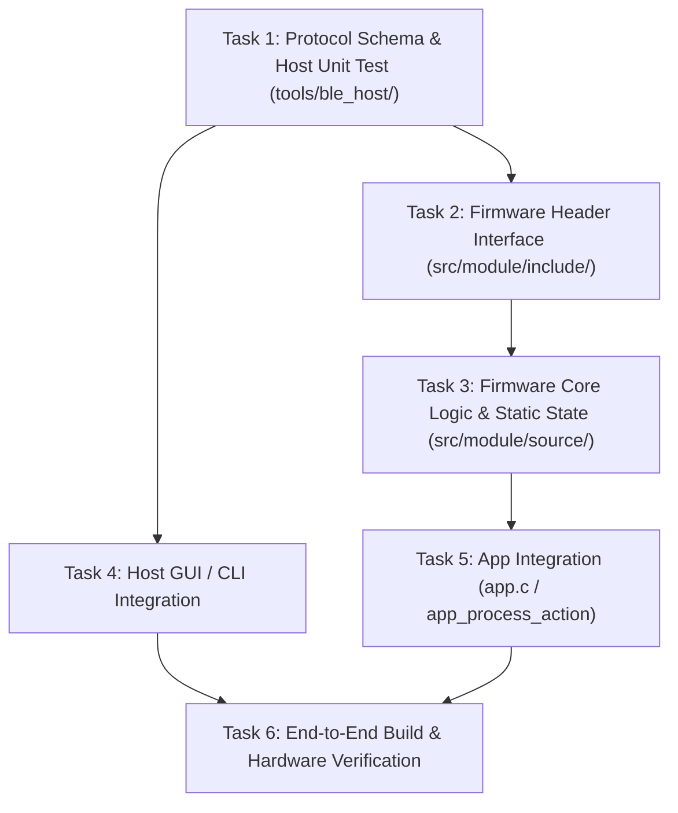

# PRD Decomposition & DAG Builder (`/prd-to-issues`)

Use this skill after a PRD is approved to break down implementation into small, testable, vertical tracer bullets.

---

## 1. Vertical Tracer Bullet Philosophy

Avoid horizontal layering where you build all drivers first, then all protocols, then all UI without testing end-to-end.
Instead, create **thin vertical slices**:

```
Tracer Bullet 1: Minimal Frame Round-Trip
[Host Frame Pack] ──BLE──> [Firmware Parser] ──ACK──> [Host Unpack]

Tracer Bullet 2: Driver & State Integration
[Hardware Sensor Read] ──FSM──> [Frame Pack] ──Notify──> [Host GUI Display]

Tracer Bullet 3: Robustness & Error Recovery
[Disconnection / CRC error] ──Recovery FSM──> [Safe State Restored]
```

---

## 2. DAG Task Graph Template

Output the task breakdown with explicit dependencies in your task plan:



---

## 3. Issue Specification Format

For each task in the plan:
1. **Task ID & Name**: e.g., `Task 1: Protocol framing & pytest`
2. **Inputs / Dependencies**: Which previous tasks must be complete.
3. **Files to touch**: Exact list of files (following Deep Module pattern).
4. **Verification Step**: Immediate automated command to verify completion.
