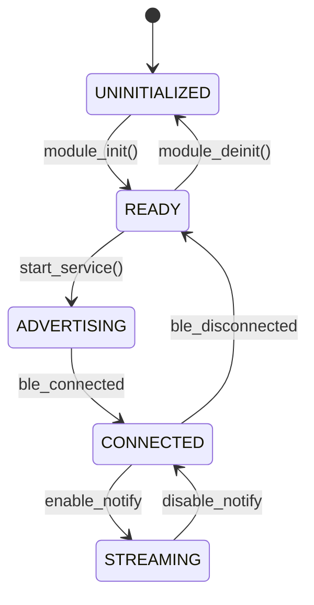

# Embedded PRD Generator (`/write-a-prd`)

Use this skill after completing the `/grill-me` interview to generate a structured, unambiguous requirements specification before coding.

---

## PRD Structure (`PRD-<feature>.md`)

The generated PRD artifact must follow this standard format:

```markdown
# PRD: [Feature Name] - Silicon Labs IoT Service

## 1. Executive Summary & Goals
- Brief description of the feature/service.
- Value proposition and functional goals.
- Non-goals (explicitly what this feature will NOT do).

## 2. Target Hardware & Peripheral Allocation
- **Target MCU:** Silicon Labs EFR32MG24 (BRD4187C).
- **Pin / Peripheral Mapping:**
  | Peripheral | Pin | Mode / Config | Notes |
  | :--- | :--- | :--- | :--- |
  | EUSART0 | PB01 (TX), PB02 (RX) | 115200 8N1 | VCOM / CLI |
  | I2C0 | PC04 (SDA), PC05 (SCL)| 400kHz Fast Mode | Sensor Bus |
  | Timer | TIMER0 / LETIMER0 | Periodic interrupt | 100ms tick |

## 3. Protocol & Data Schemas
### A. GATT Service / Protocol Frame
- Custom Service UUID: `xxxxxxxx-xxxx-xxxx-xxxx-xxxxxxxxxxxx`
- Characteristics / Opcode Table:
  | Opcode | Name | Type | Payload Format | Description |
  | :--- | :--- | :--- | :--- | :--- |
  | 0x10 | CMD_SET_CONFIG | Write | `<HHB` (Target, Timeout, Mode) | Configure service |
  | 0x80 | EVT_DATA_STREAM| Notify | `<BBI...` (SensorID, Count, Samples) | Periodic data |

### B. State Machine Architecture


## 4. Concurrency, Power & Memory Budget
- **Execution Model:** Bare-metal state machine (`app_process_action()`) OR FreeRTOS Task (`Priority: osPriorityNormal`, `Stack: 512 words`).
- **Power Modes:** Allowed to enter EM2 deep sleep during idle periods (`sl_power_manager`).
- **RAM / Flash Budget:** Max RAM: `X KB`, Max Flash: `Y KB`. Statically allocated.

## 5. Public C Interface Contract
```c
// include/sl_iot_<feature>.h
sl_status_t sl_iot_<feature>_init(const sl_iot_<feature>_config_t *config);
void sl_iot_<feature>_process(void);
sl_status_t sl_iot_<feature>_deinit(void);
```

## 6. Verification Criteria & Acceptance Tests
1. Unit tests pass with `pytest` for host binary framing.
2. Clean build via `cmake_gcc/` with zero warnings.
3. Successful flash and RTT log output on target hardware.
```
